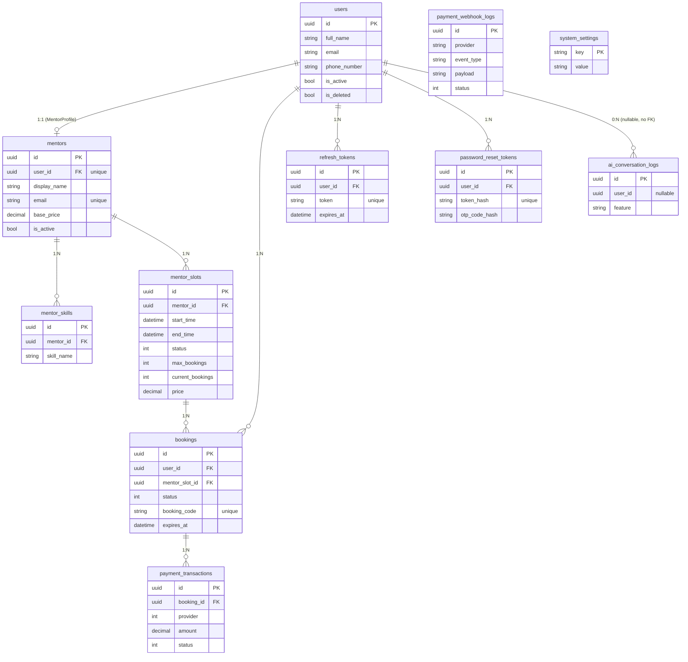

# Kiến trúc Database — Mini Booking System

> Tài liệu này mô tả kiến trúc database của hệ thống, được trích xuất từ tầng
> `MiniBookingSystem.Domain` (các entity & enum) kết hợp với cấu hình EF Core ở tầng
> `MiniBookingSystem.Infrastructure` (các `IEntityTypeConfiguration<T>`, `ApplicationDbContext`).

## 1. Tổng quan

- **DBMS**: PostgreSQL
- **ORM**: Entity Framework Core (.NET 10)
- **Quy ước đặt tên**: `snake_case` cho bảng và cột (`UseSnakeCaseNamingConvention()`).
- **Khóa chính**: hầu hết các bảng dùng `Guid` (`uuid`) sinh ở tầng ứng dụng.
- **Authentication**: dựa trên **ASP.NET Core Identity** (`IdentityDbContext<ApplicationUser, IdentityRole<Guid>, Guid>`).
- **Soft delete**: phần lớn entity nghiệp vụ kế thừa `BaseEntity` và áp dụng global query filter `is_deleted != true`.

### Phân lớp & vị trí mô hình

`ApplicationUser` (bảng `users`) **không** nằm trong tầng Domain mà ở tầng Infrastructure
(`Identity/ApplicationUser.cs`), vì nó kế thừa `IdentityUser<Guid>`. Tầng Domain không được
phép tham chiếu Identity, nên các quan hệ tới user được cấu hình từ phía "sở hữu khóa ngoại"
bằng `HasOne<ApplicationUser>()` (shadow relationship). Đây là lý do `Booking.UserId`,
`Mentor.UserId`, `RefreshToken.UserId`… là `Guid` thuần thay vì navigation property.

## 2. Lớp cơ sở (Base) & quy ước chung

### `BaseEntity` (lớp trừu tượng — không map thành bảng)

| Cột | Kiểu | Mặc định | Ghi chú |
|-----|------|----------|---------|
| `id` | `uuid` | `Guid.NewGuid()` | Khóa chính |
| `created_at` | `timestamptz` | `UtcNow` | Set khi insert |
| `updated_at` | `timestamptz` | `UtcNow` | Tự cập nhật trong `SaveChangesAsync` |
| `is_deleted` | `boolean?` | `false` | Soft delete flag |
| `deleted_at` | `timestamptz?` | `null` | Thời điểm soft delete |

Các bảng kế thừa `BaseEntity`: `refresh_tokens`, `password_reset_tokens`, `mentors`,
`mentor_skills`, `mentor_slots`, `bookings`, `payment_transactions`, `payment_webhook_logs`,
`ai_conversation_logs`.

Các bảng **không** kế thừa `BaseEntity`: `users` (Identity, có cột audit riêng),
`system_settings` (khóa chính dạng string).

## 3. Sơ đồ quan hệ (ERD)

## 4. Chi tiết các bảng

### 4.1 Module Auth

#### `users` (ASP.NET Identity — `ApplicationUser : IdentityUser<Guid>`)

Mở rộng bảng Identity mặc định với các cột nghiệp vụ.

| Cột | Kiểu | Ràng buộc | Ghi chú |
|-----|------|-----------|---------|
| `id` | `uuid` | PK | |
| `user_name`, `email`, `password_hash`, `security_stamp`… | | | Cột chuẩn của Identity |
| `full_name` | `varchar(200)` | NOT NULL | |
| `avatar_url` | `text` | NULL | |
| `phone_number` | `varchar(15)` | NULL | Unique (filter: `phone_number IS NOT NULL AND is_deleted = false`) |
| `is_active` | `boolean` | NOT NULL, default `true` | |
| `is_deleted` | `boolean` | NOT NULL, default `false` | Soft delete |
| `created_at` | `timestamptz` | NOT NULL | |
| `updated_at` | `timestamptz?` | NULL | |
| `deleted_at` | `timestamptz?` | NULL | |

**Index**: unique có điều kiện trên `phone_number`.

**Bảng Identity đi kèm** (đổi tên sang snake_case): `roles`, `user_roles`, `user_claims`,
`user_logins`, `user_tokens`, `role_claims`. Roles trong hệ thống: `Admin`, `Mentor`, `User`.

#### `refresh_tokens` (`RefreshToken : BaseEntity`)

| Cột | Kiểu | Ràng buộc |
|-----|------|-----------|
| `id` | `uuid` | PK |
| `user_id` | `uuid` | FK → `users.id`, **ON DELETE CASCADE** |
| `token` | `text` | NOT NULL, **unique** |
| `expires_at` | `timestamptz` | NOT NULL |
| `revoked_at` | `timestamptz?` | NULL |
| `created_by_ip` | `varchar(50)` | NULL |
| `revoked_by_ip` | `varchar(50)` | NULL |
| `replaced_by_token` | `text` | NULL |
| `device_info` | `text` | NULL |
| `is_used` | `boolean` | NOT NULL |

**Index**: unique trên `token`; index thường trên `user_id`.

#### `password_reset_tokens` (`PasswordResetToken : BaseEntity`)

| Cột | Kiểu | Ràng buộc |
|-----|------|-----------|
| `id` | `uuid` | PK |
| `user_id` | `uuid` | FK → `users.id`, **ON DELETE CASCADE** |
| `token_hash` | `varchar(128)` | NOT NULL, **unique** |
| `otp_code_hash` | `varchar(128)` | NOT NULL |
| `expires_at` | `timestamptz` | NOT NULL |
| `consumed_at` | `timestamptz?` | NULL |
| `attempts` | `int` | NOT NULL, default `0` |

**Index**: unique trên `token_hash`; index thường trên `user_id`. Các thuộc tính
`IsConsumed`, `IsExpired` là computed → `Ignore()` (không map cột).

### 4.2 Module Mentor

#### `mentors` (`Mentor : BaseEntity`)

| Cột | Kiểu | Ràng buộc |
|-----|------|-----------|
| `id` | `uuid` | PK |
| `user_id` | `uuid` | FK → `users.id` (**1:1**), **unique**, ON DELETE RESTRICT |
| `display_name` | `varchar(200)` | NOT NULL |
| `email` | `varchar(256)` | NOT NULL, **unique** |
| `bio` | `text` | NULL |
| `specialization` | `text` | NULL |
| `experience_years` | `int` | NOT NULL |
| `base_price` | `decimal(18,2)` | NOT NULL |
| `avatar_url` | `text` | NULL |
| `is_active` | `boolean` | NOT NULL, default `true` |
| `facebook_url` | `varchar(500)` | NULL |
| `github_url` | `varchar(500)` | NULL |
| `linked_in_url` | `varchar(500)` | NULL |
| `telegram_url` | `varchar(500)` | NULL |
| `website_url` | `varchar(500)` | NULL |

**Index**: unique trên `user_id`, unique trên `email`.

#### `mentor_skills` (`MentorSkill : BaseEntity`)

| Cột | Kiểu | Ràng buộc |
|-----|------|-----------|
| `id` | `uuid` | PK |
| `mentor_id` | `uuid` | FK → `mentors.id`, **ON DELETE CASCADE** |
| `skill_name` | `varchar(100)` | NOT NULL |

#### `mentor_slots` (`MentorSlot : BaseEntity`)

Khung thời gian mentor mở để được đặt lịch.

| Cột | Kiểu | Ràng buộc |
|-----|------|-----------|
| `id` | `uuid` | PK |
| `mentor_id` | `uuid` | FK → `mentors.id`, **ON DELETE CASCADE** |
| `name` | `varchar(200)` | NOT NULL |
| `start_time` | `timestamptz` | NOT NULL |
| `end_time` | `timestamptz` | NOT NULL |
| `status` | `int` | NOT NULL — xem enum `MentorSlotStatus` |
| `description` | `varchar(1000)` | NULL |
| `location` | `varchar(500)` | NULL |
| `max_bookings` | `int` | NOT NULL |
| `current_bookings` | `int` | default `0` |
| `price` | `decimal(18,2)` | NOT NULL |

**Enum `MentorSlotStatus`**: `Available=1`, `FullyBooked=2`, `Blocked=3`, `Cancelled=4`, `Completed=5`.

### 4.3 Module Booking

#### `bookings` (`Booking : BaseEntity`)

| Cột | Kiểu | Ràng buộc |
|-----|------|-----------|
| `id` | `uuid` | PK |
| `user_id` | `uuid` | FK → `users.id`, **ON DELETE RESTRICT** |
| `mentor_slot_id` | `uuid` | FK → `mentor_slots.id`, **ON DELETE RESTRICT** |
| `status` | `int` | NOT NULL — xem enum `BookingStatus` |
| `booking_code` | `varchar(50)` | NOT NULL, **unique** |
| `booked_at` | `timestamptz` | NOT NULL |
| `confirmed_at` | `timestamptz?` | NULL |
| `cancelled_at` | `timestamptz?` | NULL |
| `expires_at` | `timestamptz` | NOT NULL — hết hạn sau 15 phút nếu chưa thanh toán |
| `cancellation_reason` | `varchar(1000)` | NULL |
| `notes` | `varchar(2000)` | NULL |

**Enum `BookingStatus`**: `PendingPayment=1`, `Confirmed=2`, `Cancelled=3`, `Completed=4`, `Expired=5`.

**Index**:
- Unique trên `booking_code`.
- **Partial unique index** `ix_bookings_user_slot_active_unique` trên `(user_id, mentor_slot_id)`
  với filter `status IN (1, 2)` — một user chỉ có **một booking đang hoạt động**
  (PendingPayment hoặc Confirmed) cho mỗi slot.

### 4.4 Module Payments

#### `payment_transactions` (`PaymentTransaction : BaseEntity`)

| Cột | Kiểu | Ràng buộc |
|-----|------|-----------|
| `id` | `uuid` | PK |
| `booking_id` | `uuid` | FK → `bookings.id`, **ON DELETE RESTRICT** |
| `provider` | `int` | NOT NULL — enum `PaymentProvider` (lưu dưới dạng `int`) |
| `provider_transaction_id` | `text` | NULL |
| `provider_order_code` | `varchar(100)` | NOT NULL |
| `amount` | `decimal(18,2)` | NOT NULL |
| `currency` | `varchar(10)` | NOT NULL, default `"VND"` |
| `status` | `int` | NOT NULL — enum `PaymentStatus` |
| `payment_url` | `text` | NULL |
| `qr_code_url` | `text` | NULL |
| `paid_at` | `timestamptz?` | NULL |
| `expired_at` | `timestamptz?` | NULL |
| `raw_callback_data` | `text` | NULL |
| `failure_reason` | `text` | NULL |

**Enum `PaymentProvider`**: `Mock=0`, `SePay=1`, `VNPay=2`.
**Enum `PaymentStatus`**: `Pending=1`, `Succeeded=2`, `Failed=3`, `Expired=4`, `Cancelled=5`.

#### `payment_webhook_logs` (`PaymentWebhookLog : BaseEntity`)

Lưu nhật ký webhook thô từ cổng thanh toán (không có FK trực tiếp tới booking).

| Cột | Kiểu | Ràng buộc |
|-----|------|-----------|
| `id` | `uuid` | PK |
| `provider` | `varchar(50)` | NOT NULL |
| `event_type` | `varchar(100)` | NOT NULL |
| `external_reference` | `text` | NULL |
| `payload` | `text` | NOT NULL |
| `received_at` | `timestamptz` | NOT NULL |
| `processed_at` | `timestamptz?` | NULL |
| `status` | `int` | NOT NULL — enum `PaymentWebhookLogStatus` |
| `error_message` | `text` | NULL |

**Enum `PaymentWebhookLogStatus`**: `Received=1`, `Processed=2`, `Ignored=3`, `Failed=4`.

### 4.5 System

#### `ai_conversation_logs` (`AiConversationLog : BaseEntity`)

| Cột | Kiểu | Ràng buộc |
|-----|------|-----------|
| `id` | `uuid` | PK |
| `user_id` | `uuid?` | NULL — **không** có FK constraint (hỗ trợ tương tác ẩn danh) |
| `feature` | `varchar(100)` | NOT NULL |
| `prompt` | `text` | NOT NULL |
| `response` | `text` | NOT NULL |
| `model_name` | `varchar(100)` | NOT NULL |

#### `system_settings` (`SystemSetting` — **không** kế thừa `BaseEntity`)

Cấu hình key/value của hệ thống.

| Cột | Kiểu | Ràng buộc |
|-----|------|-----------|
| `key` | `varchar(200)` | **PK** (string) |
| `value` | `text` | NOT NULL |
| `updated_at` | `timestamptz` | NOT NULL |

## 5. Tổng hợp quan hệ & hành vi xóa

| Quan hệ | Loại | ON DELETE |
|---------|------|-----------|
| `users` → `mentors` | 1:1 | RESTRICT |
| `users` → `bookings` | 1:N | RESTRICT |
| `users` → `refresh_tokens` | 1:N | CASCADE |
| `users` → `password_reset_tokens` | 1:N | CASCADE |
| `mentors` → `mentor_skills` | 1:N | CASCADE |
| `mentors` → `mentor_slots` | 1:N | CASCADE |
| `mentor_slots` → `bookings` | 1:N | RESTRICT |
| `bookings` → `payment_transactions` | 1:N | RESTRICT |
| `users` → `ai_conversation_logs` | logic, không FK | — |

**Nguyên tắc**: dữ liệu định danh/tài chính (mentor, booking, payment) dùng `RESTRICT` để
chống mất dữ liệu; dữ liệu phụ thuộc vòng đời tài khoản/mentor (token, skill, slot) dùng `CASCADE`.

## 6. Soft delete & query filter

Mọi entity nghiệp vụ áp dụng global query filter `IsDeleted != true` (trừ
`password_reset_tokens` và `system_settings`). `SaveChangesAsync` tự động set `created_at`/
`updated_at` cho các entity kế thừa `BaseEntity`.

---

*Nguồn: `api/src/MiniBookingSystem.Domain/Modules/**` và
`api/src/MiniBookingSystem.Infrastructure/Persistence/**`.*
